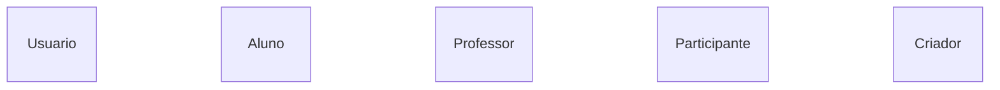
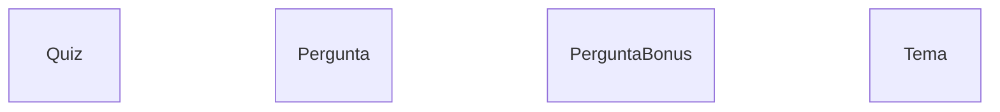
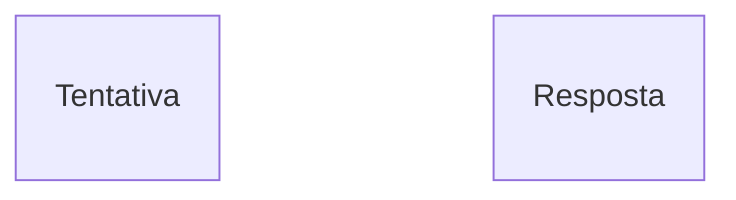
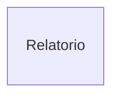

# # 🧠 Sistema de Quiz Educacional

> **Projeto individual - Programação Orientada a Objetos (2026.2)**
> Um sistema de quiz educacional baseado em linha de comando, permitindo a criação e gerenciamento de quizzes, cadastro de questões, execução de tentativas, registro de respostas, cálculo de pontuação e geração de relatórios de desempenho. O sistema utiliza conceitos de Programação Orientada a Objetos, como herança, múltipla herança, encapsulamento, composição, associações e validações, além da persistência de dados utilizando JSON.

## 📌 Sumário:

* [Descrição do projeto](#ℹ️-descrição-do-projeto)
* [Objetivo](#-objetivo-do-projeto)
* [Como começar](#-como-começar)
* [Estrutura do projeto](#️-estrutura-do-projeto)
* [Classes planejadas](#-classes-planejadas)
* [Decisões de design](#-decisões-de-design)
* [Funcionalidades](#-funcionalidades)
* [Cobertura dos testes](#-cobertura-dos-testes)

---

<br>
<br>

## ℹ️ Descrição do projeto:

O projeto consiste no desenvolvimento de um sistema de quiz educacional executado por linha de comando. O sistema busca simular um ambiente de aplicação de avaliações, permitindo que professores criem e gerenciem quizzes, enquanto alunos e professores podem participar das avaliações.

A aplicação contará com questões organizadas por temas e diferentes níveis de dificuldade, além do registro das tentativas realizadas pelos usuários. A partir dos resultados obtidos serão disponibilizadas informações relacionadas ao desempenho dos participantes.

O sistema será desenvolvido utilizando Programação Orientada a Objetos, buscando aplicar conceitos como `Herança`, `Múltipla Herança`, `Encapsulamento`, `Composição`, `Associação` e `Validação`.

### Lista de tecnologias utilizada:

1. `Python`;
2. `JSON`;
3. `Pytest`;
4. `CLI`;
5. `Mermaid`.

---

<br>
<br>

## 🎯 Objetivo do projeto:

O objetivo deste projeto é aplicar os conhecimentos adquiridos ao longo da cadeira de Programação Orientada a Objetos em um sistema prático.

O projeto busca demonstrar a aplicação de conceitos como `Herança`, `Múltipla Herança`, `Encapsulamento`, `Composição`, `Associação` e `Validação`, além da utilização de classes com responsabilidades distintas, persistência de dados e testes automatizados.

---

<br>
<br>

## 💻 Como começar:

```text
Será documentado posteriormente
```

---

<br>
<br>

## 🏗️ Estrutura do Projeto:

A estrutura adotada busca organizar o projeto de acordo com as principais entidades e responsabilidades do sistema. Cada domínio possui sua própria pasta, mantendo suas classes separadas e facilitando a manutenção e evolução da aplicação.

```text
📂 projeto-quiz-educacional
│
├── 📂 data
│   ├── usuarios.json
│   ├── quizzes.json
│   ├── tentativas.json
│   └── temas.json
│
├── 📂 docs
│   ├── decisoes-de-design.md
│   └── UML.md
│
├── 📂 src
│   │
│   ├── 📂 usuario
│   │   ├── __init__.py
│   │   ├── usuario.py
│   │   ├── aluno.py
│   │   └── professor.py
│   │
│   ├── 📂 quiz
│   │   ├── __init__.py
│   │   ├── quiz.py
│   │   ├── pergunta.py
│   │   └── pergunta_bonus.py
│   │
│   ├── 📂 tema
│   │   ├── __init__.py
│   │   └── tema.py
│   │
│   ├── 📂 tentativa
│   │   ├── __init__.py
│   │   ├── tentativa.py
│   │   └── resposta.py
│   │
│   ├── 📂 relatorio
│   │   ├── __init__.py
│   │   └── relatorio.py
│   │
│   ├── 📂 papeis
│   │   ├── __init__.py
│   │   ├── participante.py
│   │   └── criador.py
│   │
│   └── dados.py
│
├── 📂 tests
│   ├── test_usuario.py
│   ├── test_quiz.py
│   ├── test_pergunta.py
│   ├── test_tentativa.py
│   └── test_relatorio.py
│
├── .gitignore
├── main.py
├── README.md
└── requirements.txt
```

### Organização das entidades

* `usuario/` — classes relacionadas aos usuários do sistema.
* `quiz/` — classes relacionadas aos quizzes e suas questões.
* `tema/` — gerenciamento dos temas das questões.
* `tentativa/` — execução dos quizzes e registro das respostas.
* `relatorio/` — geração dos relatórios e análises.
* `papeis/` — comportamentos reutilizados através de múltipla herança.
* `data/` — arquivos JSON utilizados para persistência dos dados.
* `docs/` — documentação e modelagem do projeto.
* `tests/` — testes automatizados.
* `dados.py` — módulo responsável pelas operações de persistência dos dados.

---

<br>
<br>

## 💭 Classes planejadas:

Abaixo está uma representação simplificada das classes planejadas inicialmente para o desenvolvimento deste projeto.

### Usuários e papéis



### Quiz e questões



### Execução



### Relatórios



Para visualizar o diagrama UML desenvolvido, [clique aqui](UMLquiz.md).

---

<br>
<br>

## 🧱 Decisões de design:

As decisões de design tomadas ao longo do projeto buscam atender aos requisitos definidos para o sistema e aplicar de forma coerente os conceitos de Programação Orientada a Objetos.

Entre as principais decisões estão a utilização de `Pergunta` como classe base, a especialização de `PerguntaBonus`, a utilização de `Participante` e `Criador` como papéis reutilizáveis por meio de múltipla herança e a composição entre `Quiz` e `Pergunta` e entre `Tentativa` e `Resposta`.


---

<br>
<br>

## 🎮 Funcionalidades:

```text
Será documentado posteriormente
```

---

<br>
<br>

## 🧩 Cobertura dos testes:

```text
Será documentado posteriormente
```

---
